# MyMacCleaner

A modern, open-source macOS system utility app with Apple's Liquid Glass UI design.


[](https://buymeacoffee.com/prot10)
[](https://paypal.me/andreaprotani99)

**[Website](https://prot10.github.io/MyMacCleaner/)** | **[Documentation](https://prot10.github.io/MyMacCleaner/docs/)** | **[Download](https://github.com/Prot10/MyMacCleaner/releases/latest)**

## Overview

MyMacCleaner is a free, open-source alternative to commercial Mac cleaning apps like CleanMyMac. Built with SwiftUI and featuring Apple's latest Liquid Glass design language, it provides a beautiful and efficient way to maintain your Mac.

## Features

| Feature | Description |
|---------|-------------|
| **Smart Scan** | One-click scan of all cleanup categories |
| **Disk Cleaner** | Remove system junk, caches, logs, and temporary files |
| **Browser Privacy** | Deep clean browser history, cookies, cache, and passwords |
| **Space Lens** | Visual treemap of disk usage to find large files |
| **Orphaned Files** | Find and remove leftover files from uninstalled apps |
| **Duplicates** | Find exact duplicate files using SHA256 hashing |
| **Performance** | RAM optimization and maintenance scripts |
| **Applications** | Uninstall apps completely with leftover detection |
| **Port Management** | View and kill processes using network ports |
| **System Health** | Manage startup items and monitor system stats |
| **Permissions** | Review and manage folder access permissions |
| **Menu Bar** | Monitor CPU and RAM usage from the menu bar |

## Screenshots

### Home & Smart Scan
<p align="center">
  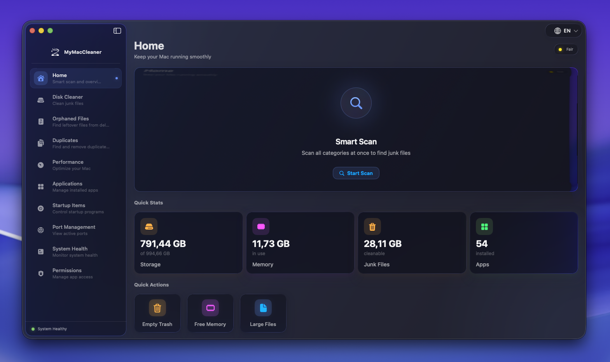
  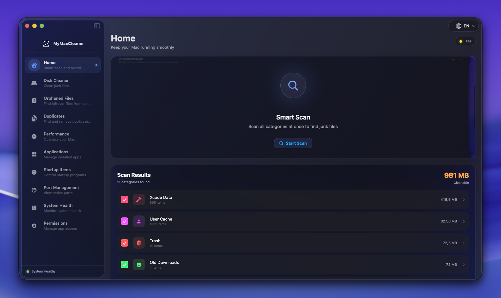
</p>

### Disk Cleaner & Space Lens
<p align="center">
  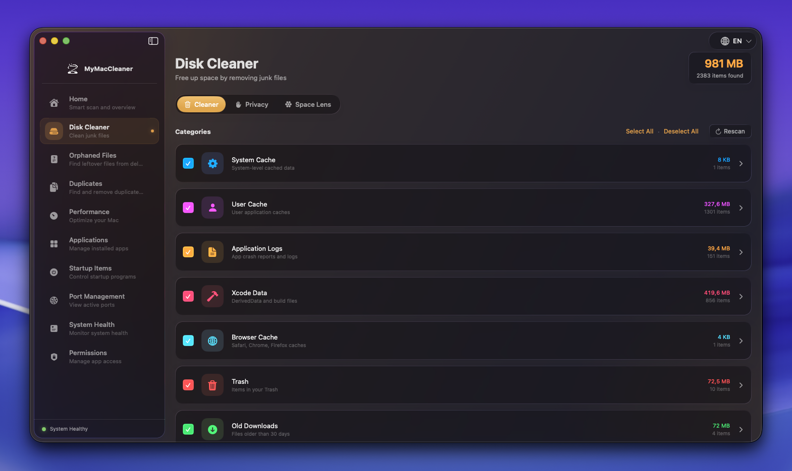
  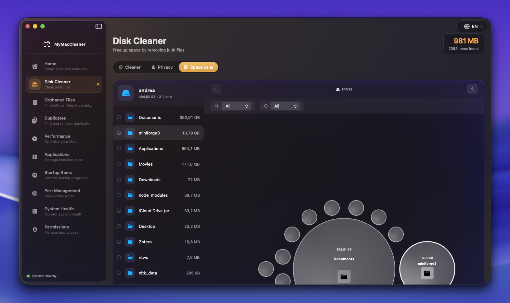
</p>

### Performance & System Health
<p align="center">
  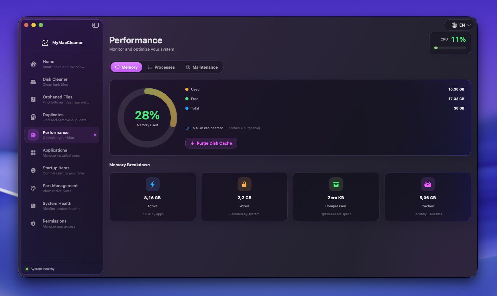
  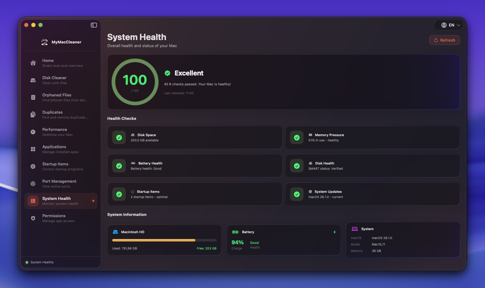
</p>

### Applications & Port Management
<p align="center">
  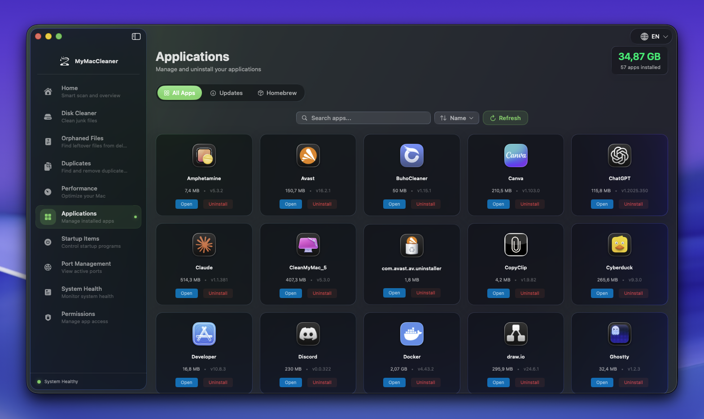
  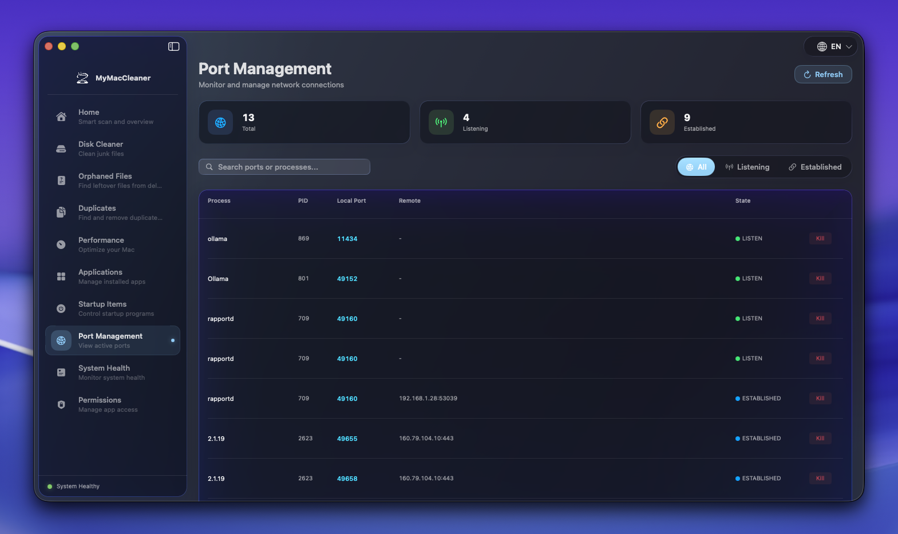
</p>

### Duplicates & Orphaned Files
<p align="center">
  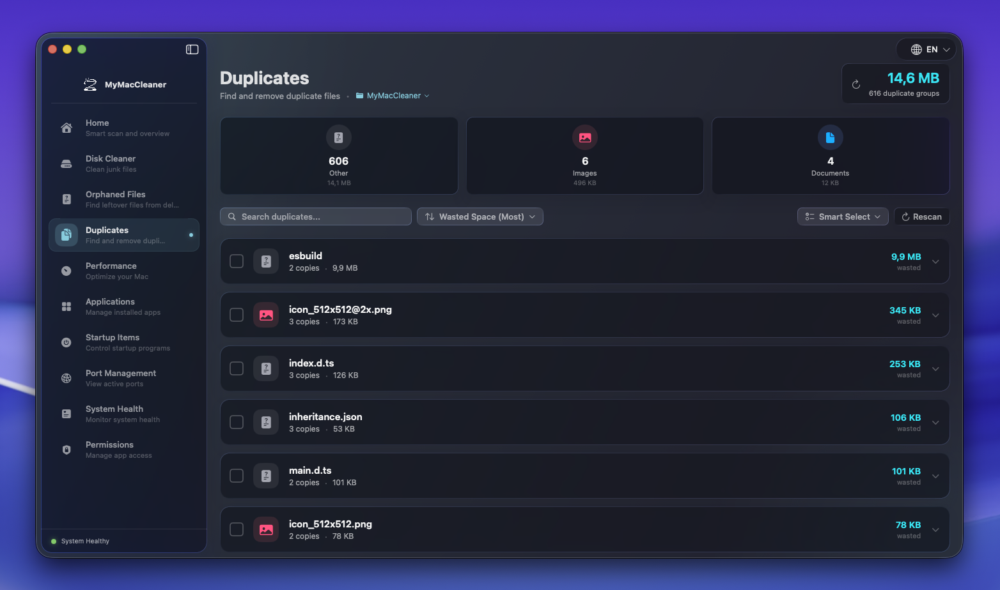
  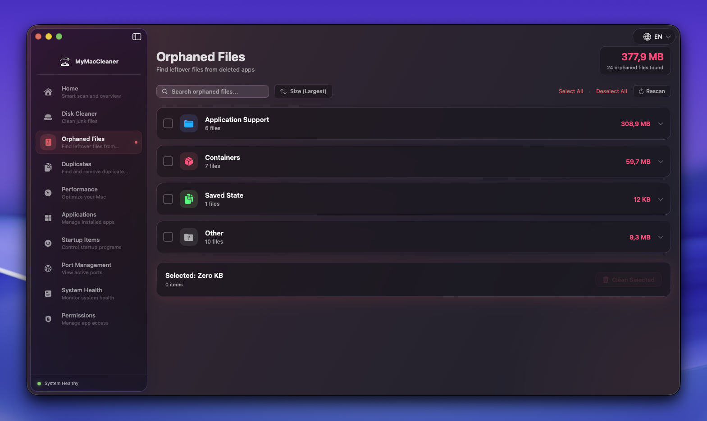
</p>

### Startup Items & Permissions
<p align="center">
  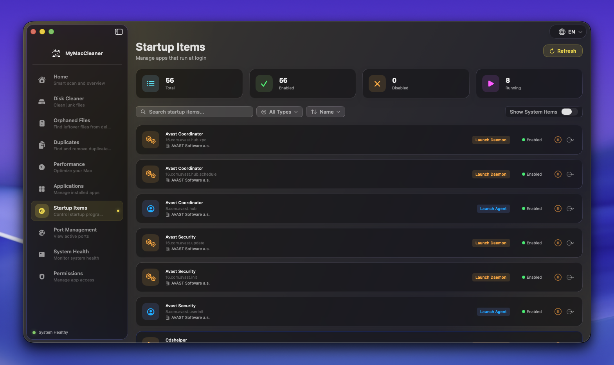
  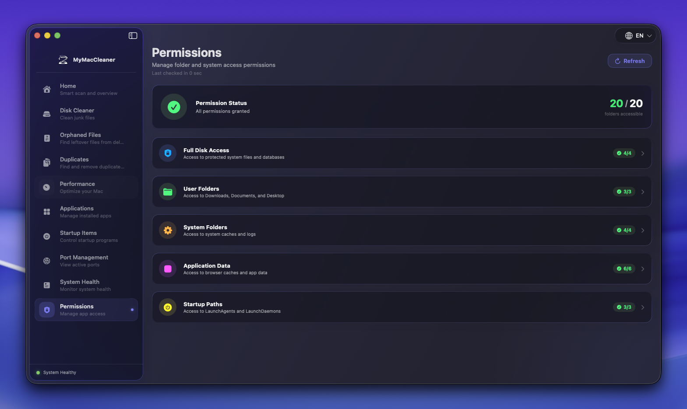
</p>

### Menu Bar Monitor
<p align="center">
  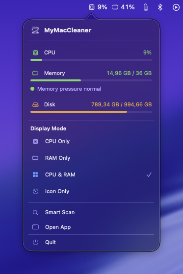
</p>

## Requirements

- macOS 14.0 (Sonoma) or later
- For native Liquid Glass effects: macOS 26.0 (Tahoe) or later
- On macOS 14-15: Beautiful material-based fallback UI

## Installation

### Download

1. Download the latest `.dmg` from the [Releases](https://github.com/Prot10/MyMacCleaner/releases) page
2. Open the DMG and drag **MyMacCleaner** to your **Applications** folder
3. **First Launch** - Since the app is not notarized, macOS will show a security warning

### Bypassing Gatekeeper (Required on First Launch)

Since MyMacCleaner is distributed for free without Apple Developer signing, macOS Gatekeeper will block it initially. This is normal for open-source apps distributed outside the App Store.

**To open the app:**

1. Try to open MyMacCleaner → You'll see *"Apple cannot check it for malicious software"*
2. Open **System Settings** → **Privacy & Security**
3. Scroll down to the **Security** section
4. Find the message about MyMacCleaner being blocked
5. Click **"Open Anyway"**
6. Enter your password to confirm

After this one-time setup, the app will open normally.

> **Alternative:** Right-click the app and select "Open" from the context menu, then click "Open" in the dialog.

### Build from Source

```bash
# Clone the repository
git clone https://github.com/Prot10/MyMacCleaner.git

# Open in Xcode
cd MyMacCleaner
open MyMacCleaner.xcodeproj

# Build and run (Cmd + R)
```

## Permissions

MyMacCleaner requests permissions only when needed:

| Permission | When Requested | Why Needed |
|------------|----------------|------------|
| Full Disk Access | When scanning system directories | Access caches, logs, and app data |
| Automation | When uninstalling apps | Clean up app leftovers completely |

See [Permissions Guide](docs/permissions.md) for detailed information.

## Documentation

- [Home & Smart Scan](docs/home.md)
- [Disk Cleaner & Browser Privacy](docs/disk-cleaner.md)
- [Space Lens](docs/space-lens.md)
- [Orphaned Files](docs/orphaned-files.md)
- [Duplicate Finder](docs/duplicates.md)
- [Performance](docs/performance.md)
- [Applications](docs/applications.md)
- [Port Management](docs/port-management.md)
- [System Health](docs/system-health.md)
- [Menu Bar Monitor](docs/menu-bar.md)
- [Permissions Guide](docs/permissions.md)

## Automatic Updates

MyMacCleaner includes built-in automatic update checking powered by the Sparkle framework. The app periodically checks for new versions in the background, and when an update is available, a notification button appears next to the language switcher in the app toolbar. This provides a seamless update experience - simply click the button to download and install the latest version without leaving the app.

## Tech Stack

- **Language**: Swift 5.9+
- **UI Framework**: SwiftUI
- **Design**: Apple Liquid Glass (macOS Tahoe style)
- **Concurrency**: Swift async/await, TaskGroups
- **Updates**: Sparkle Framework (automatic background checks with in-app notification)

## Attribution

This project builds upon and is inspired by several excellent open-source projects:

| Project | Usage | License |
|---------|-------|---------|
| [Pearcleaner](https://github.com/alienator88/Pearcleaner) | App uninstallation patterns | Apache 2.0 |
| [Stats](https://github.com/exelban/stats) | System monitoring techniques | MIT |
| [Clean-Me](https://github.com/Kevin-De-Koninck/Clean-Me) | Junk file categories | MIT |
| [Latest](https://github.com/mangerlahn/Latest) | App update detection | MIT |
| [Sparkle](https://github.com/sparkle-project/Sparkle) | Auto-update framework | MIT |
| [FullDiskAccess](https://github.com/inket/FullDiskAccess) | Permission handling | MIT |

## Contributing

Contributions are welcome! Please read our contributing guidelines before submitting a PR.

1. Fork the repository
2. Create your feature branch (`git checkout -b feature/amazing-feature`)
3. Commit your changes (`git commit -m 'Add amazing feature'`)
4. Push to the branch (`git push origin feature/amazing-feature`)
5. Open a Pull Request

## License

This project is licensed under the MIT License - see the [LICENSE](LICENSE) file for details.

## Support

If you find MyMacCleaner useful, consider supporting the project:

[](https://paypal.me/andreaprotani99)
[](https://buymeacoffee.com/prot10)

- [Open an Issue](https://github.com/Prot10/MyMacCleaner/issues)
- [Discussions](https://github.com/Prot10/MyMacCleaner/discussions)
- [Star on GitHub](https://github.com/Prot10/MyMacCleaner) - It helps a lot!

---

Made with ❤️ for the Mac community by [Andrea Protani](https://github.com/Prot10)
